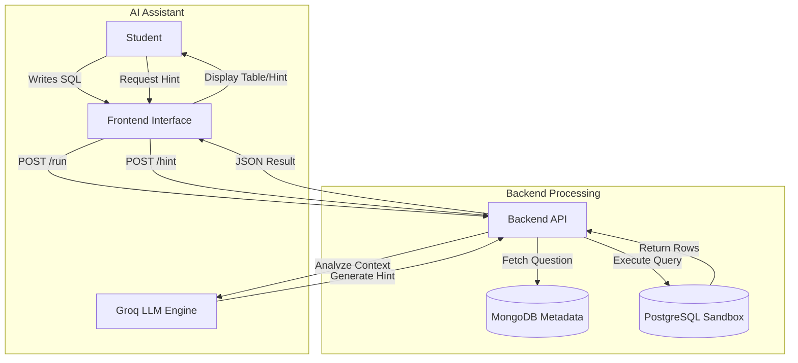
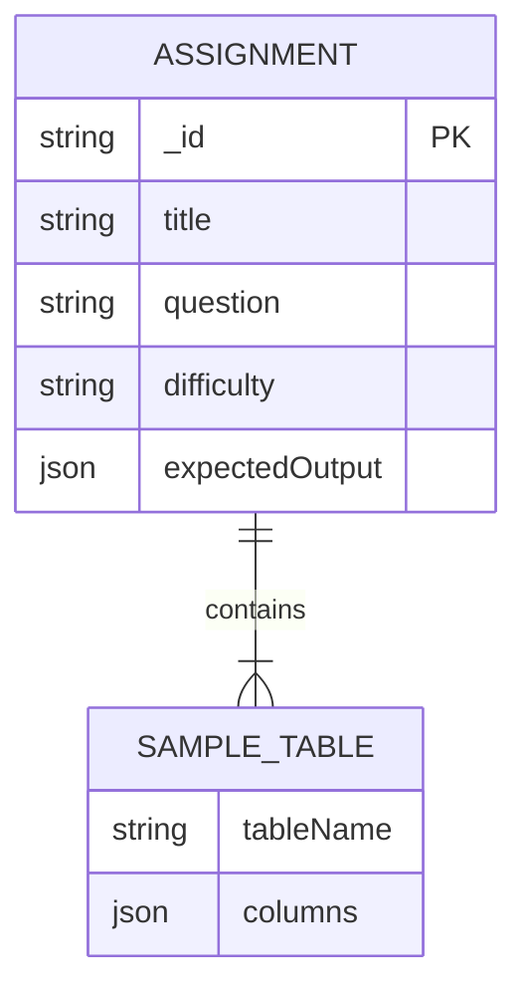

# System Architecture

## 1. Data Flow Diagram (DFD)
This diagram illustrates how data flows from the user, through the API, to the databases and the AI engine.

## 2. Entity Relationship Diagram (ERD)
The schema design for storing coding challenges in MongoDB

